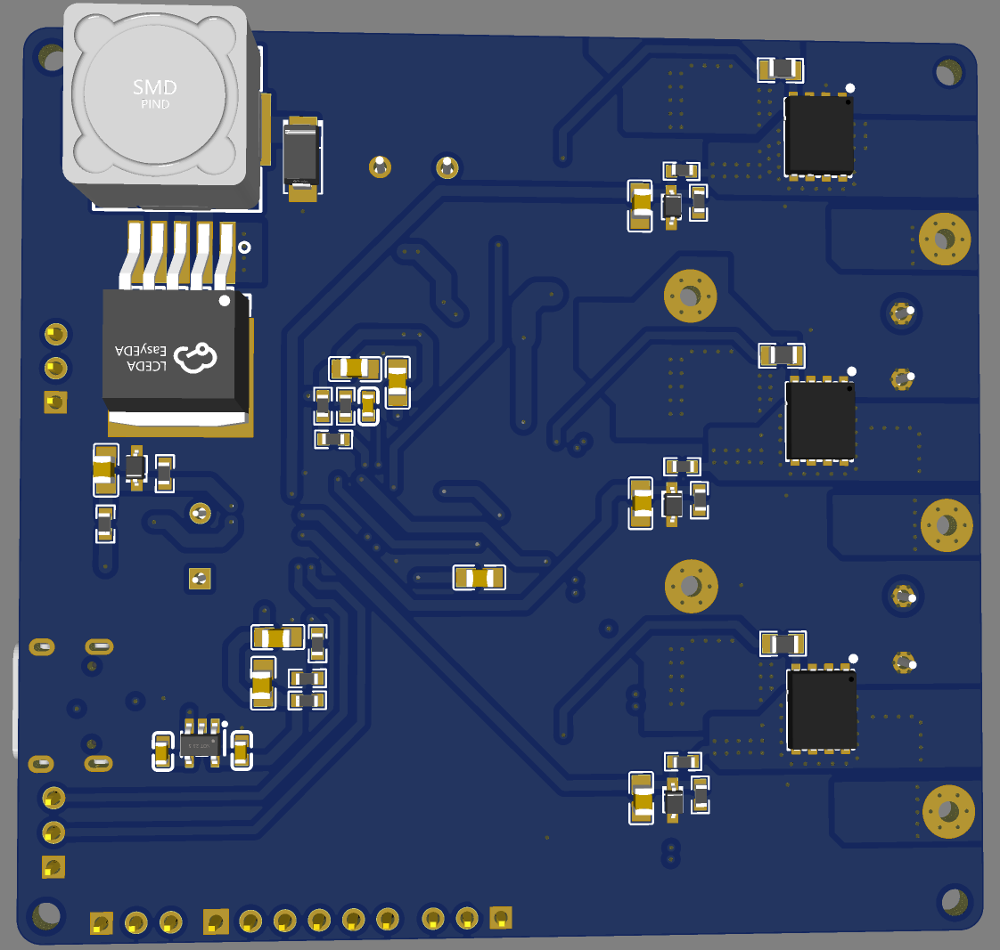
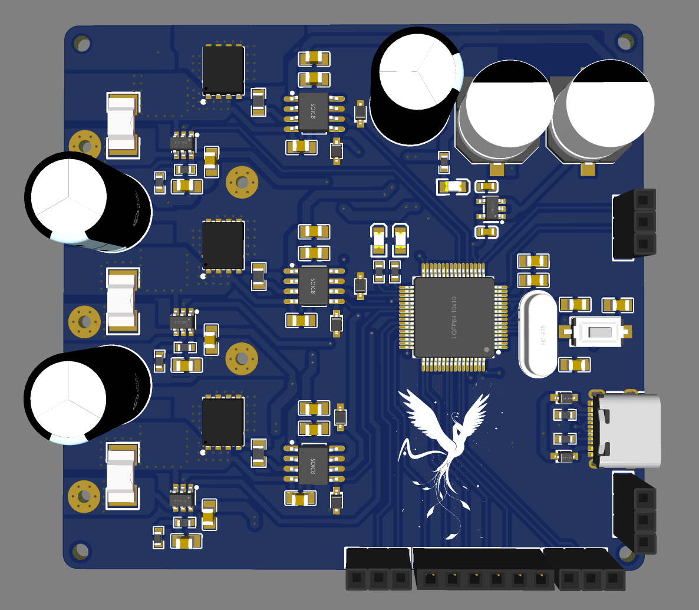
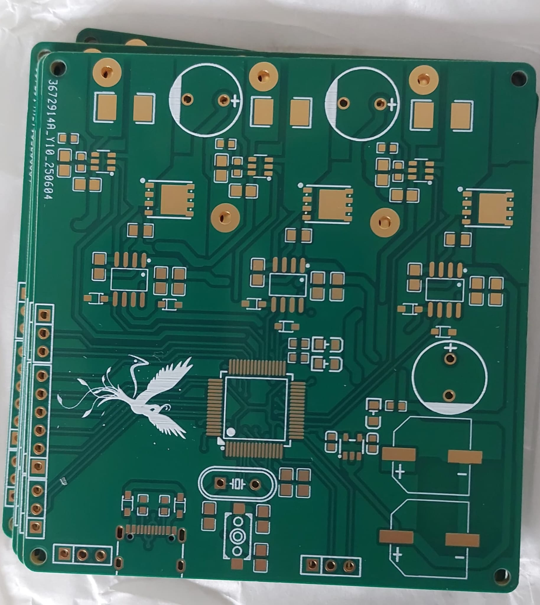

# 6‑Layer STM32F446RE BLDC Motor Controller 🛠️

## Overview  
This project implements a high-performance **48 V, 20 A** BLDC motor controller designed for a shoulder series-elastic actuator. Built on an STM32F446RE microcontroller and a 6-layer PCB, the system supports robust Field-Oriented Control (FOC), sensorless torque estimation, and real-time communications—all optimized for sub‑microsecond latency.

---

## Features  

### Hardware & Power  
- **6‑layer PCB** with STM32F446RE MCU  
- Supports **48 V DC input**, **20 A continuous current**  
- **Precision current sensing** (±0.005 A)  
- Dual **14‑bit magnetic encoders**  
- Protection: EMI suppression, reverse-polarity protection, resistive braking support  

### Firmware & Control  
- **FOC** using Clarke–Park transforms  
- **Cascaded PID control loops** – 2 kHz position loop, 30 kHz current loop  
- **Q‑learning**–tuned outer loop  
- Smooth ramp profiling with **soft-start SFC** and **cubic trajectory planning**  

### Connectivity  
- Interfaces: **CAN**, **USB**, **UART** for telemetry and control  

### Thermal Design  
- PCB layout and thermal analysis optimized for high-current operation

---

## Specifications

| Specification               | Details                                                                  |
|-----------------------------|--------------------------------------------------------------------------|
| **Microcontroller**         | STM32F446RE on 6‑layer PCB                                               |
| **Supply Voltage**          | 48 V DC                                                                  |
| **Continuous Current**      | 20 A                                                                     |
| **Current Sensing Accuracy**| ±0.005 A                                                                 |
| **Encoders**                | Dual 14‑bit magnetic encoders                                            |
| **Protection**              | EMI, reverse‑polarity, resistive braking                                 |
| **Control Method**          | FOC (Clarke–Park based)                                                  |
| **Position Loop**           | 2 kHz                                                                    |
| **Current Loop**            | 30 kHz                                                                   |
| **Trajectory Planning**     | Soft-start SFC and cubic profiles                                        |

## Gallery  

### 🔧 3D PCB Model  
<table>
  <tr>
    <td align="center">
       
      <strong>Pcb bottom layer</strong>
    </td>
    <td align="center">
       
      <strong>PCB top layer</strong>
    </td>
  </tr>
</table>

### ⚙️ Raw PCB  
  

### 🛠️ Fabricated PCB (Assembled)  
  

---
